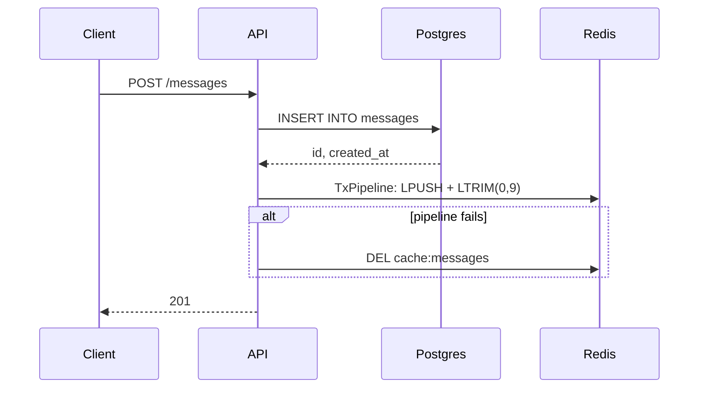
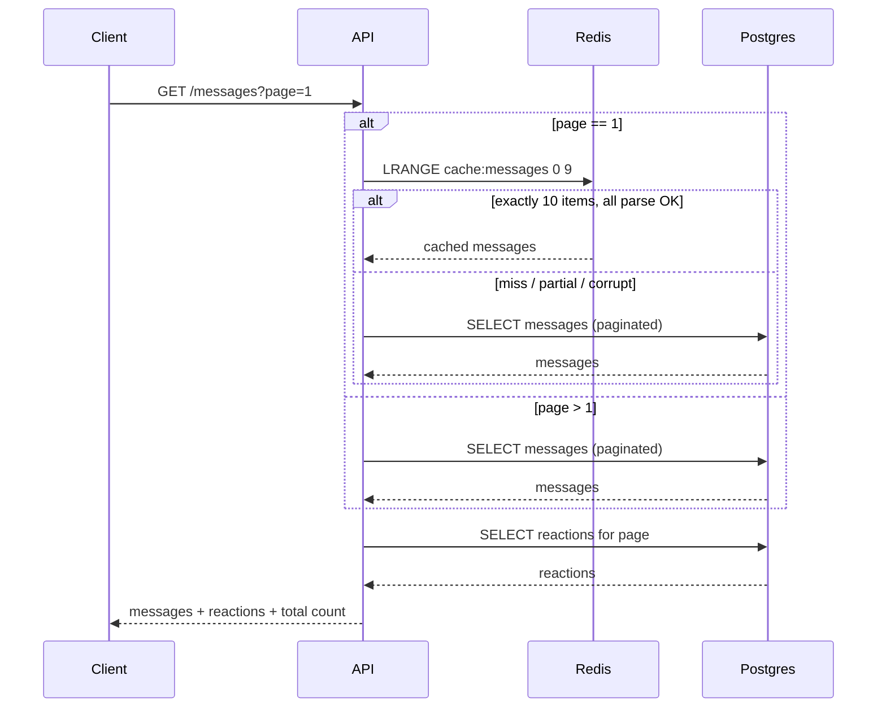
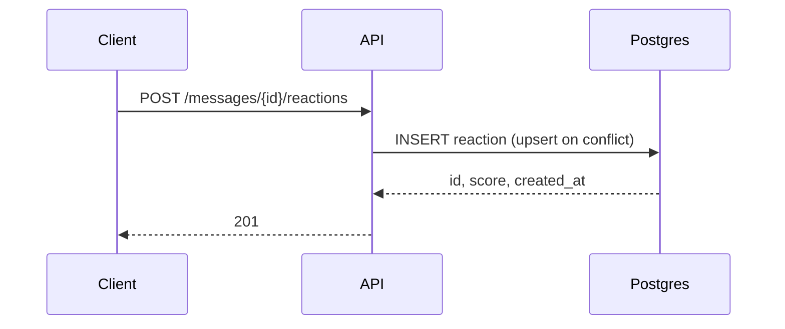

# message-api

an independent implementation of an old GetStream backend engineering assignment built from scratch. the assignment is a small REST API for creating and retrieving messages and adding reactions using Go, PostgreSQL, Redis and Docker

## request flow

### `POST /messages`



### `GET /messages`



paginated query: `ORDER BY created_at DESC, id DESC LIMIT 10 OFFSET ...`

### `POST /messages/{messageId}/reactions`



repeat reactions accumulate their score using an upsert on `(message_id, user_id, type)`

## Interpretations

> *"If the cache does not contain the requested messages, the application fetches the messages from the database"*
- **interpretation:** a dual-write to postgres and redis can partially fail causing the cache to desync from the db
- **implementation:** strict cache validation. if redis returns a partial page (`len < 10`), it is treated as a miss. if the redis pipeline fails during `POST`, the cache key is invalidated (`DEL`) so the next read falls back to the database truth

> *"Score... you can think of it as claps on Medium.com"*

* **interpretation:** repeat reactions from the same user for the same message and reaction type should be additive
* **implementation:** accumulate the score using `ON CONFLICT ... DO UPDATE`, incrementing the existing reaction count when the same `(message_id, user_id, type)` combination is submitted again


## API

| Method | Path                              | Body                                     | Query                | Success |
| ------ | --------------------------------- | ---------------------------------------- | -------------------- | ------- |
| `POST` | `/messages`                       | `message_text`, `user_id`                | —                    | `201`   |
| `GET`  | `/messages`                       | —                                        | `page` (default `1`) | `200`   |
| `POST` | `/messages/{messageId}/reactions` | `user_id`, `type`, `score` (default `1`) | —                    | `201`   |

## run

```bash
docker compose up -d --build
```
